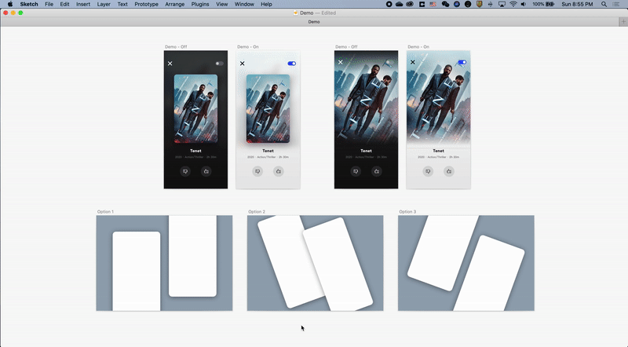
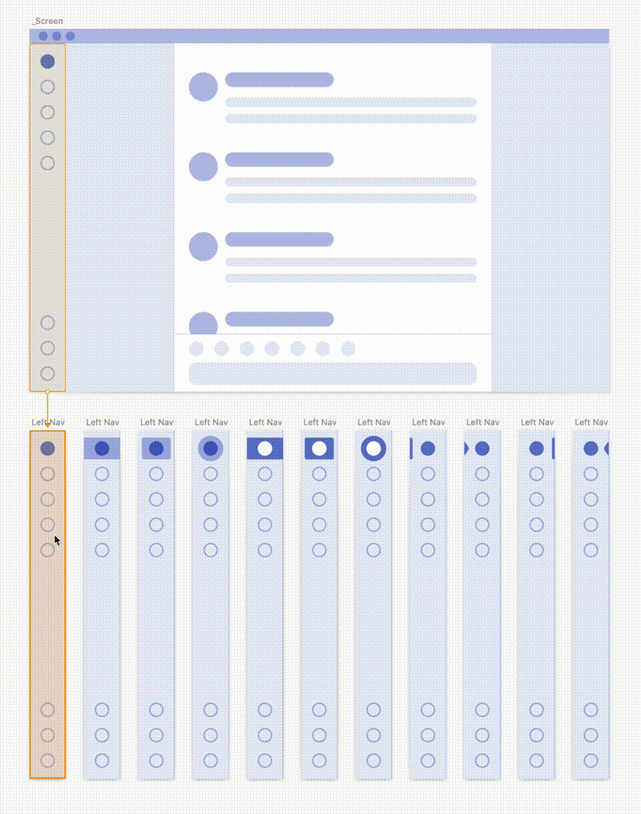
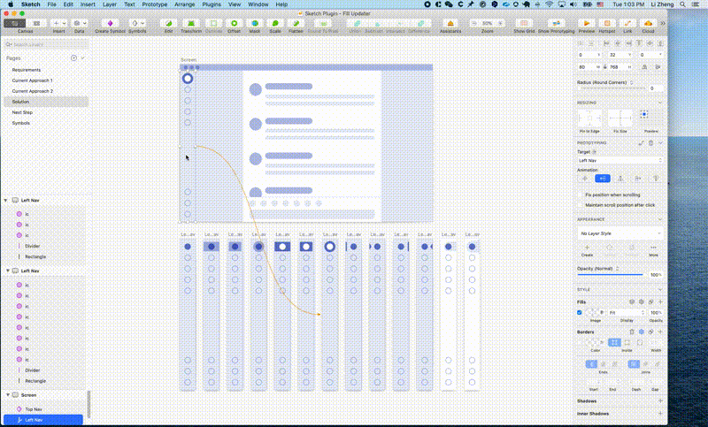
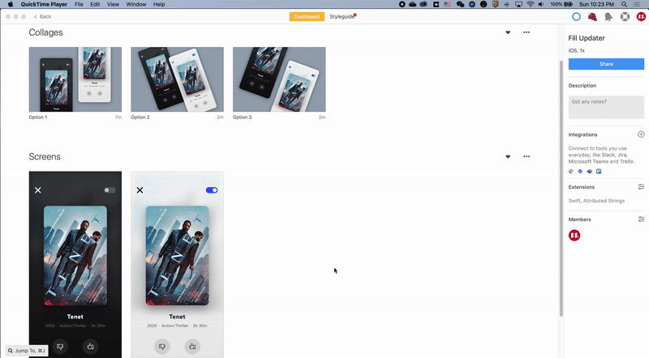

# Sketch: Fill-Updater

A Sketch plugin that fills shapes or symbols with the content of same-named artboards

## Installation

-   [Download](../../releases/latest/download/fill-updater.sketchplugin.zip) the latest release of the plugin
-   Un-zip
-   Double-click on fill-updater.sketchplugin

## How to use

-   Update content by same layer names
-   Update content by prototype links

### 1. Update

#### Same layer name

> Ensure source artboards and target elements share the same name, select desired source or target, and use the update feature to sync content.

#### Prototpye link

> Use the Prototype link to build the connections between source and target, select target elements, and use the update feature to sync content.

### 2. Export Variations

Ensure variation artboards and the element share the same name. Select the element and export.

### 3. Get Spec via Zeplin with Link

After exporting the source screens and the collages board with the instance to Zeplin, the linking feature can be used as navigation by pressing and holding the SHIFT key.

